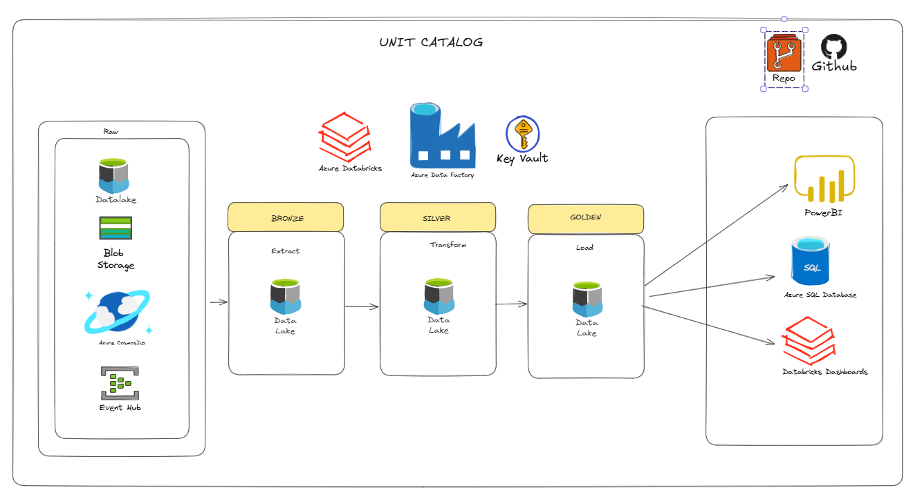

# 🚀 Proyecto_Databricks_SmartData
Repositorio que contiene el proyecto de Ingenieria de Datos con Databricks de SmartData

Se esta tomando como base la siguiente Arquitecura de Datos, se utiliza el patrón de diseño de datos "MEDALLION" para la organización en capas (Bronce, Plata y Oro) que mejora progresivamente la calidad y la madurez de los datos en un entorno de Lakehouse.

## 📘 Descripción
Lista de Servicio crados para desarrollar el proyecto es la siguiente:

* Azure DataLake Storage Gen 2
* Azure Data Factory
* Azure Databricks
* Azure Access Conector Databricks

Tambien se desarrollaron los siguintes Notebooks en Databricks
* Notebooks de Ingesta.
* Notebooks de Transformacion.
* Notebooks de Carga.

## 📦 Repositorio-Proyecto
├── .github/
│   └── workflows
│       └── script3.yml
├── proceso/
│   └── DDLs Medallion.sql
│   └── Ingest.py
│   └── Transform.py
│   └── Load.py
├── reversion/
│   └── Drop_Tables.sql
│   └── Revoke.sql
├── seguridad/
│   └── Grants.sql

Los paso a seguir para el desarrollo de esta arcuitectura es la siguiente.
  
[📄 Descargar Manual del paso a paso](Proyecto_Final.docx)

📦 tu-repositorio
├── images/
│   └── logo.png
├── src/
│   └── main.py
├── README.md
└── requirements.txt
